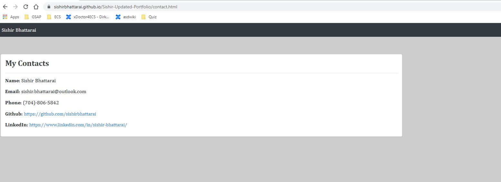

# This is my professional porfolio

## Live deployed site: 

https://sishirbhattarai.github.io/sishir-most-portfolio/.

## Technology Used: 

HTML, CSS, Bootsrap

## My portfolio:

## My contacts:

## My resume:

## My mobile version:

## Updated Portfolio

💁 Need help updating your Portfolio? Check out the [Career Services milestone resources for online presence](hhttps://sites.google.com/2u.com/careerservices-webdev/coding-milestones/milestone-polish-online-presence).

Your updated portfolio should:

1. Display your full name, email, and phone number

2. Have links to your GitHub profile and LinkedIn profile

3. Have a link to a downloadable PDF of your resume

4. Display at least 2 examples of student work from either deployed projects or homeworks. For each project, make sure you have the following:

    * Project title

    * Link to the deployed version

    * Link to the GitHub repository

    * Screenshot of the deployed application

5. Have a polished, mobile-responsive user interface.

---
© 2020 Trilogy Education Services, a 2U, Inc. brand. All Rights Reserved.
